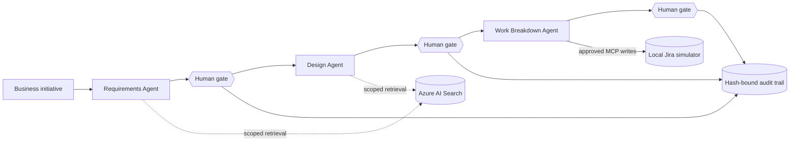

## Start here

Use this path if you are comfortable navigating Azure in a browser but do not
normally work in VS Code. You will provision and inspect every Azure resource by
clicking through the Azure portal or Microsoft Foundry. You will run the finished
application in Azure Cloud Shell, an authenticated terminal and graphical file
editor built into the browser.

You do not need desktop VS Code, GitHub Copilot, Azure CLI, Python, Git, Jira,
GitHub, or Confluence installed on your computer.

> [!IMPORTANT]
> This is **portal-first**, not portal-only. The portals create and display Azure
> resources, models, indexes, access, and traces. The repository's Python
> orchestrator, local MCP systems, approval prompts, and tamper demonstration
> must run somewhere. Azure Cloud Shell supplies that thin execution layer in
> the browser.

Allow 75 to 100 minutes for the core path. Optional tracing adds about 10
minutes.

### What you will build



Three agents turn a business initiative into requirements, a design, and a work
breakdown. A human approves each handoff. Every approval records the SHA-256
hash of the exact artifact that was reviewed, so an edit after approval
invalidates that approval automatically.

### Where each activity happens

| Activity                           | Browser surface          |
|------------------------------------|--------------------------|
| Create the Foundry project         | Microsoft Foundry        |
| Create Azure AI Search             | Azure portal             |
| Deploy chat and embedding models   | Microsoft Foundry        |
| Check access and copy endpoints    | Azure portal and Foundry |
| Install and run the application    | Azure Cloud Shell        |
| Edit `.env`                        | Cloud Shell editor       |
| Inspect the Search index           | Azure portal             |
| View optional traces               | Microsoft Foundry        |
| Delete billable workshop resources | Azure portal             |

## Before you begin

You need an Azure subscription and an identity that can:

* Create a resource group, a Microsoft Foundry project, model deployments, and
  an Azure AI Search service.
* Read Azure AI Search admin keys.
* Assign `Foundry User` to yourself, or ask an administrator to make that
  assignment.
* Create or connect Application Insights only if you complete the optional
  tracing section.

Use a dedicated resource group. That makes cleanup one deletion and prevents
workshop resources from being mixed with shared environments.

> [!WARNING]
> Azure AI Search Basic is billable while it exists, even when nobody queries
> it. Model deployments bill for inference. Application Insights bills for data
> ingestion and retention if you enable tracing. Review the price shown by the
> portal and delete the resource group when you finish.

### Workshop naming worksheet

Choose a short lowercase alias, such as `patel`. Add digits if a globally unique
name is already taken.

| Item                     | Suggested value                   | Your value |
|--------------------------|-----------------------------------|------------|
| Alias                    | `patel`                           |            |
| Resource group           | `rg-agentic-sdlc-patel`           |            |
| Foundry project          | `agentic-sdlc-patel`              |            |
| Foundry resource         | Created by project wizard         |            |
| Azure region             | Your approved region              |            |
| Search service           | `srch-agentic-sdlc-patel`         |            |
| Chat deployment          | Copy exact deployment name        |            |
| Embedding deployment     | Copy exact deployment name        |            |
| Foundry project endpoint | Copy complete endpoint            |            |
| Azure OpenAI endpoint    | Ends in `.openai.azure.com`       |            |
| Search endpoint          | Ends in `.search.windows.net`     |            |
| Search primary admin key | Copy from **Settings** > **Keys** |            |

Do not put a key in this worksheet if the Markdown file will be committed or
shared. Keep the key in your private notes until you place it in `.env`.

### Workshop networking assumptions

This browser path requires Cloud Shell to reach the public endpoints for the
Foundry resource and Azure AI Search. Use it only in a disposable workshop
resource group and only when your organization's policy permits public access.
If policy requires private endpoints, run the application from an approved
network instead of weakening that policy for the lab.

The application currently uses an Azure AI Search admin key to create its index.
On the Search service, authentication must allow **API keys** or **Both**. If an
organizational policy enforces role-based access only, this repository requires
a code change before it can index the corpus.

## Create the Foundry project

1. Open [Microsoft Foundry](https://ai.azure.com/).
2. Sign in with the identity that owns your workshop resources.
3. Turn on the **New Foundry** toggle if the portal offers a classic/new choice.
4. Open the project selector in the upper-left corner.
5. Select **Create a new project**.
6. Enter the project name from your worksheet.
7. Select **Advanced options**.
8. Select the intended Azure subscription.
9. Create the dedicated resource group from your worksheet.
10. Select your organization's approved region. You will use the same region for
    Azure AI Search where possible.
11. Select **Create project**.
12. Wait for the project welcome or overview page to appear.

The wizard creates a Foundry project under a Foundry resource. They are related
but not interchangeable. The project organizes this application. The parent
resource owns model deployments and inference endpoints.

### Record the project details

1. On the project welcome page, find **Project endpoint**.
2. Use the copy button and record the complete value as
   `FOUNDRY_PROJECT_ENDPOINT`.
3. Open the project-name menu and select **Project details**.
4. Record the parent Foundry resource name and region.

> [!IMPORTANT]
> Copy the project endpoint exactly. A current endpoint can include a project
> path such as `/api/projects/<project-name>`. Do not shorten it to the resource
> host, and do not substitute the Azure OpenAI endpoint.

## Create Azure AI Search

Start Search now because provisioning can take several minutes. You can deploy
models while it completes.

1. Open the [Azure portal](https://portal.azure.com/) in another browser tab.
2. Select **Create a resource**.
3. Search for and select **Azure AI Search**.
4. Select **Create**.
5. On **Basics**, select the same subscription and dedicated resource group.
6. Enter the globally unique Search service name from your worksheet.
7. Select the same region as the Foundry resource when it is available.
8. For **Pricing tier**, select **Basic** to match the workshop.
9. Keep the default compute type unless your organization requires another
   choice.
10. Select **Review + create**, review the estimated cost, and select **Create**.
11. Select **Go to resource** when deployment completes.
12. Confirm that the service status is **Running** on **Overview**.

### Copy the Search connection values

1. Copy the URL on **Overview**. It has the form
   `https://<service-name>.search.windows.net`.
2. In the left navigation, open **Settings** > **Keys**.
3. Confirm that authentication is **API keys** or **Both**.
4. Under the admin keys, reveal and copy the **Primary admin key**.
5. Record it privately as `SEARCH_API_KEY`.

> [!CAUTION]
> Copy an **admin** key, not a query key. The application creates an index, so a
> read-only query key will fail. The admin key is a workshop shortcut, is stored
> only in the gitignored `.env`, and must not be committed or reused in
> production.

## Deploy both models

Return to your project in [Microsoft Foundry](https://ai.azure.com/).

### Choose a compatible chat model

The historical `.env.example` names `gpt-4o-mini`, but model availability and
retirement move faster than workshop source code. Select a model that is
currently deployable in your region instead of assuming that historical model
is available.

The model card must list all three capabilities:

* Chat Completions API support
* Structured outputs
* Functions or tool calling

A current generally available Azure OpenAI mini model is a cost-conscious
workshop choice when offered in your region. Start with `gpt-4.1-mini` when it
is available because its model card includes the three capabilities this code
path needs. Avoid preview, codex-only, realtime, audio, and image-generation
variants. The application accepts any compatible deployment because the exact
deployment name is placed in `.env`.

1. In the upper-right navigation, select **Discover**.
2. In the left navigation, select **Models**.
3. Filter to Azure OpenAI models.
4. Open a currently available generally available chat model.
5. Verify the three required capabilities on its model card.
6. Select **Deploy** > **Default settings**.
7. Use the portal's available Standard, Global Standard, or approved data-zone
   deployment option.
8. Review the token capacity. The portal default is normally enough for one
   participant; use more only if quota permits.
9. Select **Deploy**.
10. Record the exact **deployment name**, including capitalization, as
    `FOUNDRY_MODEL`.

### Deploy the embedding model

1. Return to **Discover** > **Models**.
2. Search for `text-embedding-3-small`.
3. Select **Deploy** > **Default settings** and complete the deployment.
4. Record the exact deployment name as `EMBEDDING_DEPLOYMENT`.

`text-embedding-3-small` emits up to 1,536 dimensions, which matches the Search
index in this repository. If it is unavailable, use
`text-embedding-3-large`. The third-generation large model accepts the
`dimensions` parameter, and this application requests 1,536 dimensions, so the
existing index schema remains compatible.

### Confirm both deployments

1. Select **Build** in the upper-right navigation.
2. Select **Models**.
3. Confirm that both deployment names appear and have a successful provisioning
   state.
4. Open the chat deployment in a playground if offered.
5. Send `Reply with READY only` and confirm that the deployment responds.

The deployment name is the application-facing identifier. It is often similar
to the model ID, but it is not necessarily identical.

## Confirm identity access

The application uses your signed-in Azure identity for both the Foundry project
and model inference. It does not use a Foundry API key.

1. In the Azure portal, open the dedicated resource group.
2. Select the parent Foundry resource from the resource list.
3. Select **Access control (IAM)**.
4. Select **View my access**.
5. Confirm that your identity has **Foundry User** at this resource or an
   inherited scope.

Project creation normally adds this role automatically when the creator can
assign roles. If it is missing:

1. Select **Access control (IAM)** > **Add** > **Add role assignment**.
2. On **Role**, search for and select **Foundry User**.
3. Select **Next**.
4. On **Members**, select **User, group, or service principal**.
5. Select **Select members**, choose your signed-in identity, and select
   **Select**.
6. Select **Review + assign** twice.
7. Allow a few minutes for the role assignment to propagate.

Some tenants can still display the former name **Azure AI User** while the
rename rolls out. The role ID and permissions are unchanged.

> [!IMPORTANT]
> Use `Foundry User` for this Foundry project. Current Foundry guidance advises
> against selecting a role merely because its name starts with
> `Cognitive Services`. If **Add role assignment** is disabled, an Owner, Role
> Based Access Control Administrator, or User Access Administrator must make the
> assignment for you.

## Copy the Azure OpenAI endpoint

The embedding client uses the Azure OpenAI endpoint of the parent Foundry
resource.

1. In the Azure portal, remain on the parent Foundry resource.
2. Open **Resource Management** > **Keys and Endpoint**.
3. Copy the Azure OpenAI endpoint that ends in `.openai.azure.com`.
4. Record it as `FOUNDRY_OPENAI_ENDPOINT`.

The expected base format is:

```text
https://<foundry-resource-name>.openai.azure.com
```

Do not append `/openai/v1`, a deployment path, or an API version. The repository
adds the required API route through the OpenAI SDK.

You now have all values needed by the application.

## Open Azure Cloud Shell

1. Return to the Azure portal.
2. Select the **Cloud Shell** icon in the top toolbar.
3. Select **Bash** when asked for a shell.
4. If this is your first session, follow the prompt to create or mount Cloud
   Shell storage.
5. Maximize the Cloud Shell pane or open it at
   [shell.azure.com](https://shell.azure.com/) in another tab.

Cloud Shell automatically authenticates Azure CLI as your browser identity. Its
host is temporary, but files under your home directory persist when storage is
mounted. Background processes stop when the session is recycled.

### Check the Cloud Shell environment

Paste these commands one line at a time:

```bash
python3 --version
az account show --query "{subscription:name, tenant:tenantId}" --output table
git --version
```

Python must be 3.11 or newer. Also confirm that the displayed subscription is
the one containing your workshop resource group. If it is not, select the right
subscription:

```bash
az account list --output table
az account set --subscription "<subscription name or ID>"
```

> [!NOTE]
> Cloud Shell times out after 20 minutes without interactive activity. Files
> persist, but the local MCP processes do not. If a resumed session reports that
> all three mock systems are unreachable, restart them using the command later
> in this guide.

## Get the workshop application

Clone the participant-facing public repository:

```bash
git clone https://github.com/Fastboatsmojito/Workshop_AgenticSDLC_Foundry.git
cd Workshop_AgenticSDLC_Foundry
```

If the folder already exists from an earlier session, update it instead:

```bash
cd ~/Workshop_AgenticSDLC_Foundry
git pull --ff-only
```

### Create the Python environment

```bash
python3 -m venv .venv
source .venv/bin/activate
python -m pip install --upgrade pip
python -m pip install -r requirements.txt
python -m pip install -e .
```

The active prompt normally begins with `(.venv)`. Activate it again after every
new Cloud Shell session:

```bash
cd ~/Workshop_AgenticSDLC_Foundry
source .venv/bin/activate
```

### Prove the offline half works

```bash
python -m pytest -q
```

All tests should pass without calling Azure. They cover typed artifacts,
hash-bound approvals, gate behavior, corpus chunking, and the local MCP
servers. A passing suite means later failures are likely access or configuration
issues rather than Python defects.

## Configure the application

Create the private environment file and open it in Cloud Shell's graphical
editor:

```bash
cp .env.example .env
code .env
```

The **Editor** button in the Cloud Shell toolbar opens the same graphical editor
if the command does not. Replace the file contents with the following values
from your worksheet:

```text
FOUNDRY_PROJECT_ENDPOINT=<paste the complete project endpoint>
FOUNDRY_MODEL=<paste the exact chat deployment name>

FOUNDRY_OPENAI_ENDPOINT=<paste the endpoint ending in .openai.azure.com>
EMBEDDING_DEPLOYMENT=<paste the exact embedding deployment name>
EMBEDDING_API_VERSION=2024-10-21
EMBEDDING_DIMENSIONS=1536

SEARCH_ENDPOINT=<paste the endpoint ending in .search.windows.net>
SEARCH_API_KEY=<paste the primary admin key>
SEARCH_INDEX_NAME=sdlc-corpus

MCP_JIRA_URL=http://127.0.0.1:8931/mcp
MCP_GITHUB_URL=http://127.0.0.1:8932/mcp
MCP_CONFLUENCE_URL=http://127.0.0.1:8933/mcp

APPROVER_ALIAS=<your recognizable name or alias>
ENABLE_TRACING=false
```

Do not wrap values in quotes or angle brackets. Replace every placeholder,
select **File** > **Save**, and close the editor.

> [!CAUTION]
> `.env` contains the Search admin key. It is excluded by `.gitignore`. Do not
> use `git add -f`, paste the file into chat, or commit it to a fork.

## Start the local systems of record

The repository includes real MCP servers that simulate Jira, GitHub, and
Confluence. Start them in the background so the same Cloud Shell terminal can
run the workshop:

```bash
mkdir -p .runs
python -m mcp_servers.run_all > .runs/mcp-servers.log 2>&1 &
echo $! > .runs/mcp-servers.pid
```

Check the configuration and all three MCP endpoints:

```bash
python -m agentic_sdlc.cli check
```

Success looks like an **Environment check** table with three green rows and the
message `Environment looks good.` The check prints configuration and contacts
the MCP servers. The next indexing step is the first end-to-end validation of
Search, embedding inference, Entra authentication, and model deployment names.

If a local MCP row is red, inspect the background log:

```bash
cat .runs/mcp-servers.log
```

## Build the governance index

Run the repository's ingestion pipeline:

```bash
python -m agentic_sdlc.cli index
```

The application creates `sdlc-corpus`, splits four fictional governance
documents on section boundaries, generates embeddings, and uploads the chunks.
Success includes both of these messages, with a machine-dependent chunk count:

```text
index 'sdlc-corpus' ready
indexed <count> chunks from <path>/data/corpus
```

### Inspect the result in the Azure portal

1. Open the Azure AI Search service.
2. Under **Search management**, select **Indexes**.
3. Select `sdlc-corpus`.
4. Confirm that the document count is greater than zero.
5. Inspect the fields and confirm that `doc_type` is filterable and
   `content_vector` has 1,536 dimensions.
6. Open **Search explorer**.
7. Run a simple `*` search and inspect a few chunks.

The `doc_type` field is the governance boundary. Each agent receives a search
tool filtered to only the document types it may use. The Requirements Agent
cannot retrieve architecture standards, and the Design Agent cannot retrieve
unrelated material.

## Run the governed flow

Start with the well-specified sample initiative:

```bash
python -m agentic_sdlc.cli run INIT-1042
```

The command can take several minutes because each agent retrieves evidence,
calls the model, and produces a validated structured artifact.

### Respond to stage gates

At each yellow **HUMAN APPROVAL REQUIRED** panel:

1. Read the summary, schema, model, and content hash.
2. Enter `v` to view the complete JSON when needed.
3. Enter `a` to approve the artifact for the workshop happy path.
4. Press Enter to accept the default approver alias.
5. Add an optional comment or press Enter.

Other choices are `r` to reject, `e` to edit one top-level field using JSON, and
`q` to abandon the run. An edit is schema-validated and changes the artifact
hash before approval.

### Respond to Jira tool approvals

The Work Breakdown Agent writes to the local Jira simulator. Each proposed epic,
story, and test case appears in a cyan **TOOL CALL NEEDS APPROVAL** panel.
Review the arguments and enter `y` to allow each write for the happy path.
Enter `n` to demonstrate a blocked write. The agent must omit a rejected item
from its final artifact rather than silently claiming that it was created.

A successful run ends with `Flow complete.` and prints paths for three artifacts
under `.runs/INIT-1042/`.

## Inspect the evidence

### View artifacts in the browser editor

Open the run directory in Cloud Shell's graphical editor:

```bash
code .runs/INIT-1042
```

Use the file explorer to inspect:

* `requirements.json`
* `design.json`
* `work_breakdown.json`

Each file is a typed contract produced by one stage, not free-form prose passed
between agents.

### View and verify approvals

```bash
python -m agentic_sdlc.cli audit INIT-1042
python -m agentic_sdlc.cli verify INIT-1042
```

The audit command shows who decided, at which stage, against which artifact
hash, and under which audit ID. Verification should report that every saved
artifact is covered by an approval for its exact content.

The authoritative append-only trail is also available at `.runs/audit.jsonl`.
The local Confluence simulator receives a best-effort copy.

## Prove that approval is bound to content

Modify the approved requirements artifact through the provided safe tamper
command, then verify it again:

```bash
python -m agentic_sdlc.cli tamper INIT-1042
python -m agentic_sdlc.cli verify INIT-1042
```

The second command should fail verification and explain that the approved hash
does not match the current hash. That failure is the successful outcome of the
demonstration: approval covered exact content, not merely a filename or stage
label.

Re-run the flow if you want a newly approved clean artifact. Each run appends
new decisions to the audit trail.

## Try an under-specified initiative

`INIT-1077` deliberately omits important constraints:

```bash
python -m agentic_sdlc.cli run INIT-1077 --stop-after requirements
```

A trustworthy result fails several Definition of Ready checks and raises open
questions. An all-green assessment is not a success. It means the agent inferred
facts that the initiative and permitted corpus did not establish.

## Add portal tracing

This section is optional. Tracing for an external or workflow-style agent can be
a preview capability in Foundry, and it can capture prompts, responses, tool
arguments, and retrieved content.

> [!WARNING]
> Complete this section only with the repository's fictional data. Treat trace
> data as production telemetry, apply access and retention controls, and never
> place secrets or real customer data in prompts or tool arguments.

### Connect Application Insights

1. Open your project in Microsoft Foundry and confirm **New Foundry** is on.
2. In the left navigation, select **Agents**.
3. At the top, select **Traces**.
4. Select **Connect**.
5. Select an existing Application Insights resource or select **Create new**.
6. Keep a new resource in the dedicated workshop resource group.
7. Complete the wizard and wait for the connection confirmation.

If **Connect** is not visible, open the project-name menu, select
**Project details** > **Connected resources** > **Add connection**, and choose
**Application Insights**.

To query telemetry, your identity also needs **Log Analytics Reader** on the
connected Application Insights resource or its Log Analytics workspace. Assign
it through **Access control (IAM)** using the same role-assignment steps used
earlier. Protected tables can additionally require **Privileged Monitoring Data
Reader**.

### Enable tracing in Cloud Shell

```bash
python -m pip install azure-monitor-opentelemetry
code .env
```

Change `ENABLE_TRACING=false` to `ENABLE_TRACING=true`, save the file, and run a
short flow:

```bash
python -m agentic_sdlc.cli run INIT-1042 --stop-after design
```

Return to **Agents** > **Traces** in Foundry. Refresh after ingestion completes,
open the latest trace, and inspect agent spans, model calls, tool calls, and
human approval events. Telemetry can take several minutes to appear.

## Clean up in the Azure portal

Delete the resource group after the workshop or take-home exercises:

1. Open **Resource groups** in the Azure portal.
2. Select the dedicated `rg-agentic-sdlc-<alias>` resource group.
3. Review its resources and confirm that nothing shared was placed there.
4. Select **Delete resource group** or **Delete**.
5. Enter the resource group name when prompted.
6. Select **Delete** and confirm the final warning.
7. Watch Azure notifications until deletion has started or completed.

This removes Azure AI Search, the Foundry project and resource, model
deployments, and Application Insights if you created it in the same group.

Cloud Shell files do not create meaningful workshop compute cost. To stop the
local MCP launcher and its child servers before closing the shell:

```bash
kill -INT "$(cat .runs/mcp-servers.pid)" 2>/dev/null || true
rm -f .env
```

The second command removes the persisted Search admin key. You can remove the
cloned folder later if you do not want it in your Cloud Shell file share.

## Troubleshooting

### Cloud Shell resumed and MCP checks are red

Background processes stop when the Cloud Shell host is recycled. Reactivate the
virtual environment and restart the servers:

```bash
cd ~/Workshop_AgenticSDLC_Foundry
source .venv/bin/activate
mkdir -p .runs
python -m mcp_servers.run_all > .runs/mcp-servers.log 2>&1 &
echo $! > .runs/mcp-servers.pid
python -m agentic_sdlc.cli check
```

### Python is older than 3.11

The Microsoft Agent Framework used by this repository requires Python 3.11 or
newer. Do not continue with an older interpreter. Use a current Cloud Shell
image, a facilitator-provided environment, or the local setup in
`workshop/00-prerequisites.md`.

### Foundry returns 401 or 403

* Confirm Cloud Shell shows the correct subscription and tenant.
* Copy the complete project endpoint from the project welcome page again.
* Confirm **Foundry User** on the parent Foundry resource through
  **Access control (IAM)** > **View my access**.
* Wait a few minutes after a new role assignment and retry.
* Confirm public network access is permitted from Cloud Shell under your policy.

### The chat deployment is not found

`FOUNDRY_MODEL` must contain the deployment name shown under **Build** >
**Models**, not a display name copied from the model catalog. Correct `.env`,
save it, and retry.

### Embedding calls return 401 or deployment not found

* Confirm `FOUNDRY_OPENAI_ENDPOINT` belongs to the parent Foundry resource and
  ends in `.openai.azure.com`.
* Confirm `EMBEDDING_DEPLOYMENT` exactly matches the deployment name.
* Confirm your **Foundry User** assignment is at the parent resource scope.
* Do not add `/openai/v1` or a deployment path to the endpoint in `.env`.

### Model deployment has no quota or is unavailable

Return to **Discover** > **Models** and select a generally available Azure
OpenAI model offered in your region. The chat model must support Chat
Completions, structured outputs, and tools. Update `FOUNDRY_MODEL` with the new
deployment name. Do not change Python code.

### Search returns unauthorized

* Copy the primary **admin** key, not a query key.
* Confirm **Settings** > **Keys** allows **API keys** or **Both**.
* Remove accidental quotes or spaces around `SEARCH_API_KEY` in `.env`.

### Search reports a vector dimension mismatch

Keep `EMBEDDING_DIMENSIONS=1536`. Both third-generation embedding options in
this guide can return 1,536 dimensions. Rebuild an index created with a different
shape:

```bash
python -m agentic_sdlc.cli index --recreate
```

### Traces do not appear

* Confirm the project is connected to Application Insights.
* Confirm `azure-monitor-opentelemetry` is installed in the active virtual
  environment.
* Confirm `ENABLE_TRACING=true` in `.env`.
* Run the application again and allow several minutes for ingestion.
* Confirm **Log Analytics Reader** access before querying trace data.

### The portal labels look different

Microsoft Foundry evolves frequently. Use these durable landmarks:

* The project welcome page contains the complete project endpoint.
* The project-name menu contains **Project details** and connected resources.
* **Discover** contains the model catalog.
* **Build** contains deployed models.
* The parent Foundry resource in the Azure portal contains IAM and endpoint
  settings.
* The Azure AI Search resource contains **Indexes**, **Search explorer**, and
  **Settings** > **Keys**.

## Official references

* [Set up Microsoft Foundry resources](https://learn.microsoft.com/azure/foundry/tutorials/quickstart-create-foundry-resources)
* [Foundry model catalog and capabilities](https://learn.microsoft.com/azure/foundry/foundry-models/concepts/models-sold-directly-by-azure)
* [Foundry model endpoints](https://learn.microsoft.com/azure/foundry/foundry-models/concepts/endpoints)
* [Role-based access control for Foundry](https://learn.microsoft.com/azure/foundry/concepts/rbac-foundry)
* [Create Azure AI Search in the portal](https://learn.microsoft.com/azure/search/search-create-service-portal)
* [Find Azure AI Search API keys](https://learn.microsoft.com/azure/search/search-security-api-keys)
* [Assign Azure roles in the portal](https://learn.microsoft.com/azure/role-based-access-control/role-assignments-portal)
* [Azure Cloud Shell overview](https://learn.microsoft.com/azure/cloud-shell/overview)
* [Use the Cloud Shell graphical editor](https://learn.microsoft.com/azure/cloud-shell/use-cloud-shell-editor-new)
* [Set up tracing in Microsoft Foundry](https://learn.microsoft.com/azure/foundry/observability/how-to/trace-agent-setup)
