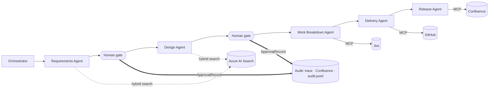

# Agentic SDLC on Microsoft Foundry

Build a governed, multi-agent software delivery lifecycle from nothing, in two
hours. Five specialist agents take a business requirement through requirements,
design, work breakdown, delivery, and release. Typed contracts move between
them, and a human approval gate stands at each handoff — hash-bound, audit
logged, and enforced, so the flow physically cannot continue on an approval that
does not cover what is in front of it.

This is a code-first workshop. You write Python against the Microsoft Agent
Framework with GitHub Copilot helping, rather than clicking through a portal.

> **New to this?** Read [docs/pre-reading.md](docs/pre-reading.md) before the
> session. It is 15 minutes and the live time assumes you have.

## Who this is for

Architects who already build agents in Copilot Studio and have run into its
ceiling: deterministic orchestration, typed contracts between agents, custom
tools, evaluation, and source-controlled CI/CD. If none of those constrain you,
Copilot Studio multi-agent is the faster path — [pre-reading §2](docs/pre-reading.md)
makes that case honestly.

## Quick start

| Track | Time | What you do |
|---|---|---|
| [Track A: build the gated flow](workshop/00-prerequisites.md) | 120 min live | Create resources, index a governance corpus, build three agents, wire the orchestrator, and watch the gate block a tampered artifact |
| [Track B: finish the lifecycle](takehome/README.md) | self-paced | Add the Delivery and Release agents, the escalation pattern, and swap every mock for the real system |

## Track A guides

| Guide | Minutes | What you build |
|---|---|---|
| [00 Before you start](workshop/00-prerequisites.md) | before | Tooling, `az login`, the vocabulary |
| [01 Create your resources](workshop/01-create-resources.md) | 0–12 | Resource group, Foundry project, **AI Search (starts provisioning first)** |
| [02 Deploy your models](workshop/02-deploy-models.md) | 12–20 | Chat and embedding deployments, `.env`, mock servers running |
| [03 Index the governance corpus](workshop/03-index-corpus.md) | 20–28 | Hybrid vector index over the Definition of Ready and standards |
| [04 Build the Requirements Agent](workshop/04-requirements-agent.md) | 28–50 | The full pattern: instructions, scoped retrieval, typed output |
| [05 Build the gate and the audit trail](workshop/05-gate-and-audit.md) | 50–75 | Approve, reject, **tamper** — and watch the handoff get blocked |
| [06 Design and Work Breakdown agents](workshop/06-design-and-breakdown.md) | 75–100 | Two more agents, plus tool approval on every Jira write |
| [07 Orchestrate and observe](workshop/07-orchestrate-and-observe.md) | 100–115 | The whole flow end to end, then read the trace |
| [Wrap up](workshop/08-wrap-up.md) | 115–120 | What you built, what is next |

Finish with [cleanup](workshop/cleanup.md). When something breaks, go to
[troubleshooting](workshop/troubleshooting.md).

## What you build



Solid arrows are handoffs of typed artifacts. Jira, GitHub, and Confluence are
mock MCP servers during the session and real MCP servers in the take-home; the
agent code does not change, only the URLs in `.env`.

## The idea worth taking away

An approval is only meaningful if you can say *what* was approved. Every decision
at a gate records the SHA-256 of the exact artifact it covers. Change the
artifact afterwards and the approval stops applying — automatically, with no
extra check to remember to write.

```bash
python -m agentic_sdlc.cli run INIT-1042      # approve at the gate
python -m agentic_sdlc.cli tamper INIT-1042   # edit the approved artifact
python -m agentic_sdlc.cli verify INIT-1042   # the approval no longer covers it
```

You do exactly this in [guide 05](workshop/05-gate-and-audit.md).

## Repository structure

```text
Workshop_AgenticSDLC_Foundry/
├── README.md                     <<<< START HERE
├── docs/
│   ├── pre-reading.md            Read before the session
│   └── architecture-spec.md      The design and why it is shaped this way
├── workshop/                     Track A, live, guides in order
├── takehome/                     Track B, self-paced
├── facilitator/                  Preparation, timing, delivery notes
├── src/agentic_sdlc/
│   ├── agents/                   The five agents, one file each
│   ├── contracts/                Typed artifacts + the approval record
│   ├── gate/                     Console gate, summaries, audit sinks
│   ├── grounding/                Index, ingest, hybrid search tool
│   ├── orchestrator.py           Sequential flow with enforced gates
│   └── cli.py                    check / index / run / verify / audit / tamper
├── mcp_servers/                  Mock Jira, GitHub, Confluence over MCP
├── data/
│   ├── corpus/                   Governance documents the agents retrieve
│   └── initiatives/              Business requirements that enter the flow
├── infra/                        Provisioning scripts + reference architecture
├── tests/                        Runs without any Azure resources
└── solutions/                    Reference run to compare your output against
```

## Prerequisites

- An Azure subscription where you can create a resource group, a Foundry
  resource, and an Azure AI Search service
- Azure CLI, signed in with `az login`
- Python 3.11 or newer
- VS Code with GitHub Copilot enabled
- Roughly 20 minutes of pre-reading

Full details in [guide 00](workshop/00-prerequisites.md).

## What it costs

Each participant creates their own Basic tier Azure AI Search service, roughly
seventy-five dollars a month while it exists. Model usage across a two-hour
session is cents. Everything lives in one resource group, so
[cleanup](workshop/cleanup.md) is a single delete — do it when you finish the
take-home.

## Verify without Azure

The tests cover the contracts, the gate, the audit trail, the corpus, the mock
MCP servers, and the reference run in `solutions/`, and need no Azure resources
at all:

```bash
python -m pytest -q
```

If you cannot get a subscription, [`solutions/`](solutions/README.md) carries a
complete run of INIT-1042 — all three artifacts and the approval trail that
covers them — so you can still read what the agents produce and watch an
approval stop applying when the artifact changes.

## A note on the two Copilots

GitHub Copilot in your editor helps *you* write the Foundry code. The **Delivery
Agent** is a Foundry agent that writes code itself — in production, that is where
the GitHub Copilot coding agent would sit. They are different things, and the
guides are careful about which one is doing what.

> [!IMPORTANT]
> The governance corpus in `data/corpus/` is fictional. It is written to be
> representative of a regulated delivery organisation so the agents have
> something real to reason against, but it is not anyone's actual policy and must
> not be used as one.
