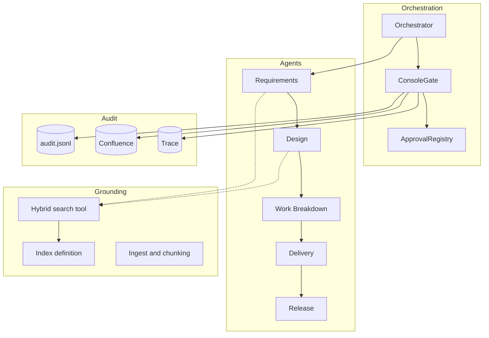

# Architecture specification

This describes what the implementation does and, more usefully, why it is shaped
this way. Decisions worth arguing about are called out as decisions, with the
alternatives that were rejected.

## 1. Problem shape

A software delivery lifecycle in a regulated organisation is a sequence of
stages, each producing an artifact, each with a human accountable for advancing
it. Automating the drafting is straightforward. Automating it *without losing the
accountability* is the actual problem, and it comes down to three questions:

1. How does one stage hand work to the next without ambiguity?
2. How does a human decision become something you can prove later?
3. What physically prevents the flow from continuing without that decision?

The answers here are typed artifacts, hash-bound approval records, and an
enforcement call before every handoff.

## 2. Component overview

| Module | Responsibility |
|---|---|
| `contracts/artifacts.py` | Typed handoff artifacts; canonical JSON and content hashing |
| `contracts/approval.py` | `ApprovalRecord`, the append-only registry, and `assert_approved` |
| `agents/*.py` | One file per agent: instructions, tools, retrieval scope, artifact type |
| `agents/base.py` | Client construction, the structured-output run, the tool-approval loop |
| `grounding/*` | Index definition, chunking and ingestion, the scoped hybrid search tool |
| `gate/*` | Console gate, artifact summaries, the three audit sinks |
| `orchestrator.py` | The sequence and the enforcement point |
| `mcp_servers/*` | Mock Jira, GitHub, and Confluence over real MCP |

## 3. Decisions

### D1 — `Agent(client=FoundryChatClient(...))`, not `FoundryAgent`

**Chosen** because this path owns instructions and tools in code, which is what
lets each agent carry a different retrieval scope and return a different artifact
type.

**Rejected:** `FoundryAgent`, where the definition lives in the Foundry portal. It
ignores tools passed at construction and strips `instructions` and `tools` from
the request, so per-agent scoping would have to be replicated as portal
configuration and could not be reviewed in a pull request.

**Cost:** agent definitions are not visible in the portal, and there is no
portal-managed versioning. For a source-controlled lifecycle that is the right
trade; for a business-managed agent it would not be.

### D2 — A hand-written orchestrator

**Chosen** because in a governed lifecycle the control flow *is* the governance
model. "What prevents requirements reaching design without approval?" should be
answerable with a line of code.

**Rejected:** `SequentialBuilder` / `HandoffBuilder` from
`agent-framework-orchestrations`. They are the right choice when routing is
dynamic or the agent population changes; here the sequence is fixed, short, and
regulated.

**Cost:** no free checkpointing, retries, or resumption. Section 7 covers what
that means for production.

### D3 — Approvals bound to a content hash

**Chosen** because an approval that names only a stage cannot answer "approved
*what*". SHA-256 over canonical JSON makes post-approval edits self-invalidating
with no separate tamper check to remember to write.

**Rejected:** approval by artifact id or version number. Both require discipline
to bump and both fail silently when someone forgets.

**Cost:** any edit invalidates approval, including a trivial one. That is
correct — a human should look again — but it means an edit-heavy review loop
generates several records. The trail showing that is a feature.

### D4 — One index, filtered by `doc_type`

**Chosen** for per-agent retrieval scoping without a service per agent. The
Requirements Agent cannot retrieve architecture standards, so scope drift is
structurally prevented rather than discouraged.

**Rejected:** one index per document type (more services, more cost, no benefit),
and a single unscoped index (agents drift into each other's stages).

### D5 — Push-model indexing with client-side embeddings

**Chosen** because chunking stays visible in Python where participants can read
and change it, and there is no indexer schedule to wait on.

**Rejected:** an indexer plus skillset with integrated vectorization. Better for
a real corpus that changes; more moving parts than a two-hour session can afford.

### D6 — Heading-aligned chunking

**Chosen** so a citation can name a real section like `DoR-06` that a human can
open and check. Verifiable citations are what make grounding trustworthy.

**Rejected:** fixed-size or token-window chunking. Better recall on prose,
citations nobody can verify.

### D7 — Mock systems as real MCP servers

**Chosen** so the integration path exercised against mocks is the one that runs
against production. Swapping to the real servers changes three URLs and no agent
code.

**Rejected:** stubbed Python functions. Simpler, but they would prove nothing
about the real integration and would leave the take-home swap untested.

### D8 — Two human-in-the-loop mechanisms

**Chosen** because they operate at different granularities and both are needed.
The stage gate approves an artifact between agents; tool approval approves one
write to a system of record.

**Cost:** conceptual overhead. It is the most common point of confusion, so the
guides name the distinction repeatedly.

### D9 — No optional fields on artifacts

**Chosen** because strict structured output requires every field to be present.
Absence is expressed as an empty list or empty string.

**Cost:** you cannot distinguish "not applicable" from "none found" without an
explicit field. Where that distinction matters, add one rather than reaching for
`| None`.

### D10 — JSONL is authoritative, other sinks are best-effort

**Chosen** so a stopped mock server degrades the trail instead of halting the
workshop, while the decision is still guaranteed durable somewhere.

**Cost:** in production Confluence would likely also be primary. The asymmetry is
a workshop concession and is marked as one in the code.

## 4. Data flow through one stage

1. Orchestrator loads the `Initiative` and renders it as a prompt.
2. Agent runs with `options={"response_format": SystemRequirements}` and calls
   its scoped search tool as needed.
3. The framework parses and validates the response; `response.value` is a typed
   artifact or a `ValidationError`.
4. Orchestrator persists it to `.runs/<initiative>/requirements.json`.
5. Gate renders a summary, the schema name, and the content hash; the human
   approves, rejects, or edits.
6. An edit is re-validated through the schema, producing a new hash.
7. An `ApprovalRecord` is written to all three sinks from one code path.
8. `assert_approved(stage, artifact)` runs. If it raises, the next agent is never
   constructed.

Step 8 is the design. Steps 1 to 7 are the supporting cast.

## 5. Threat model for the gate

| Attempt | What stops it |
|---|---|
| Continue without ever running the gate | `assert_approved` finds no record for the stage |
| Continue after a rejection | The record exists, its decision is `rejected` |
| Edit an artifact after approval | The stored hash no longer matches |
| Reuse one stage's approval at another | Records are keyed by stage |
| Approve one artifact, hand on another | The orchestrator carries `outcome.artifact` forward, and the hash catches the mismatch |
| Rewrite the trail | The registry only appends; the file is plain JSONL and reviewable |

What is **not** defended: the audit file is a local file with no signing or
access control, and anyone who can edit the source can remove the enforcement
call. Section 7 covers what production requires.

## 6. Testing strategy

Everything that does not need Azure is tested and runs in CI in seconds:

- content hashing is stable, order-independent, and change-sensitive
- approvals permit, missing approvals block, rejections block with a reason
- editing after approval invalidates it, and re-approval restores it
- approvals do not leak across stages; the trail is append-only
- the audit fan-out survives a failing secondary sink
- the corpus chunks cleanly with unique ids and citable sections
- the three mock MCP servers work over real HTTP

The agents themselves are not unit-tested — their behaviour is a model property,
not a code property. That belongs in evaluation, which is
[take-home 5](../takehome/05-evaluation.md).

## 7. What production requires

**Durable, resumable runs.** Gates take days, not seconds. Run state must persist
and resume on an approval arriving from email, Teams, or a Jira transition. This
is the largest change from what is here.

**Agent identity.** Agents run as the signed-in human today. Each should have its
own workload identity with least-privilege access, so the trail records which
agent acted.

**A real audit store.** Append-only with retention, access control, and integrity
protection. A local JSONL file demonstrates the property; it does not satisfy it.

**Secrets management.** Key Vault or managed identity end to end. No `.env`.

**Evaluation in CI.** Instructions are code and regress like code.

**Content safety and prompt-injection defence.** The corpus is trusted here. Once
requirements arrive from an intake form a customer can write into, retrieved
content becomes untrusted input.

**Network isolation.** Private endpoints for Foundry and Search, no public
ingress, egress controls on MCP destinations.

## 8. Extending it

**A new agent:** copy an existing agent module, change three things — the
retrieval scope, the artifact type, and the instructions — then add the stage and
its gate to the orchestrator.

**A new artifact:** subclass `Artifact` so it inherits canonical JSON and
hashing, and keep every field required.

**A new system of record:** add a mock MCP server, wire it as an
`MCPStreamableHTTPTool` with the write/read approval split, and keep the split
when you swap in the real server.

**A new audit sink:** implement `AuditSink` and pass it as a secondary sink. Make
it primary only if a failure there should stop the flow.
