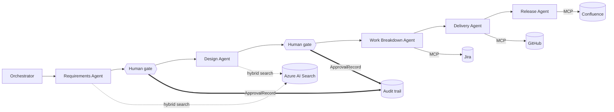
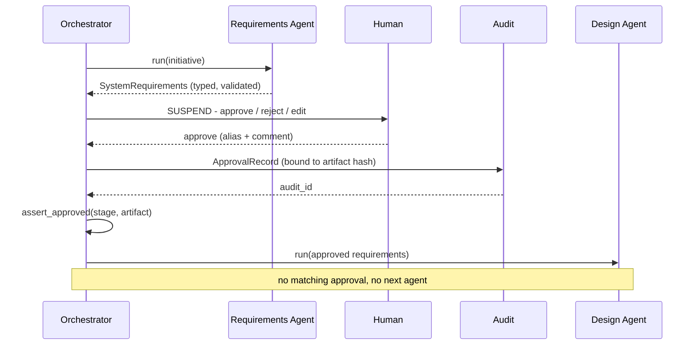

# Pre-reading — Agentic SDLC on Microsoft Foundry

**Read time:** ~15 min · **Goal:** arrive with the mental model so the two hours
are hands-on rather than a lecture.

---

## 1. Why Foundry, if you already use Copilot Studio

You already understand agents, grounding, and tools. This workshop covers what
to do when the low-code envelope stops fitting — usually when you need
deterministic multi-agent orchestration, typed contracts between agents, custom
tools, evaluation, and source-controlled CI/CD. Foundry with the Microsoft Agent
Framework gives you those by dropping to code. The concepts carry over; you get
more control and more ownership.

| In Copilot Studio | In Foundry + Agent Framework | Why you'd switch |
|---|---|---|
| Topics and triggers orchestrate the flow | An orchestrator you write in Python | Deterministic, testable, reviewable routing |
| Low-code connectors | MCP servers and custom function tools | Any system; mockable locally; versioned |
| Knowledge sources | An Azure AI Search index you configure | Control over chunking, filters, hybrid retrieval |
| Managed child agents | Agents that exchange typed artifacts | Schema-validated handoffs |
| Built-in approval nodes | Approval interrupts you control | Hash-bound, audited, enforced |
| Analytics dashboard | OpenTelemetry tracing and evaluation | Debug and score each step |
| Managed hosting | Your project, repo, and CI/CD | Source control, PR review, environments |

## 2. Why not just Copilot Studio multi-agent?

Copilot Studio supports multi-agent setups, and for many scenarios it is the
right tool — faster to build and fully managed. Reach for Foundry code-first when
you need one or more of these:

- **Deterministic orchestration** — branching, retries, and escalation written in
  code rather than expressed through topic routing.
- **Typed contracts between agents** — schema-validated objects and hash-bound
  approvals instead of passing natural language between steps.
- **Full tool control** — custom tools and MCP servers you can mock locally and
  version in source control.
- **Evaluation and tracing** — score each step, and regression-test agents in CI.
- **Lifecycle in source control** — instructions, tools, and schemas reviewed
  through pull requests and promoted across environments.
- **Retrieval control** — own the chunking, filtering, and hybrid search.

If none of these apply, Copilot Studio multi-agent is the quicker path. This
workshop assumes you have hit at least a couple of them.

## 3. The use case: a governed agentic SDLC

We model a software delivery lifecycle as a chain of specialist agents, from a
business requirement to a release package, running inside an existing governance
model: a Definition of Ready, approval gates, and an audit trail. Each stage
produces a typed artifact and a human approves before the next stage starts.

The flow is Requirements → Design → Work Breakdown → Delivery → Release, with
approval and escalation between stages.

## 4. Architecture at a glance



Jira, GitHub, and Confluence run as **mock MCP servers** on your laptop during
the session and as **real MCP servers** in the take-home. The agent code does not
change — only three URLs in `.env` do. That is the point: the integration path
you exercise against mocks is the one that runs against production.

## 5. The five agents

| # | Agent | Responsibility | Retrieval scope / tools | Artifact | Track |
|---|---|---|---|---|---|
| 0 | **Orchestrator** | Runs the sequence, enforces gates | The agents themselves | Run state + audit trail | Live |
| 1 | **Requirements** | Business need → system requirements meeting the Definition of Ready | DoR + delivery standards | `SystemRequirements` | Live |
| 2 | **Design** | Approved requirements → design in the house format | Architecture standards + design format | `DesignArtifact` | Live |
| 3 | **Work Breakdown** | Approved design → epics, stories, tests; writes to Jira | Jira over MCP | `WorkBreakdown` | Live |
| 4 | **Delivery** | One approved story → a pull request | GitHub over MCP | `PullRequest` | Take-home |
| 5 | **Release** | Merged PRs → a published release package | Confluence over MCP | `ReleasePackage` | Take-home |

Each agent's retrieval is **scoped at construction**, not left to the model. The
Requirements Agent cannot see the architecture standards, so it cannot drift into
designing the solution. Scoping retrieval is a design decision you make, not an
instruction you hope is followed.

## 6. Handoff patterns

**A. Sequential handoff with a typed contract.** Every agent returns a Pydantic
model. The orchestrator advances only on a schema-valid object, so a handoff is a
check rather than a hope.

**B. Human approval gate.** At each boundary the run suspends. A person approves,
rejects, or edits. The orchestrator resumes only on an approval bound to the
artifact's hash.

**C. Tool approval.** A *different* human-in-the-loop mechanism, and the one
people most often conflate with the gate. The stage gate approves an **artifact
between agents**; tool approval sits in front of an **individual write to a
system of record**. Both appear in this workshop.

**D. Clarification and escalation** *(take-home)*. When an agent cannot proceed
on the evidence it has, it returns a `NeedsClarification` artifact and asks,
rather than inventing an answer.



## 7. The gate and the audit trail

The gate writes an `ApprovalRecord` that is:

- **Hash-bound** — it stores the SHA-256 of the exact artifact approved, so a
  later edit silently invalidates it rather than riding along;
- **Logged three ways** — an append-only `audit.jsonl`, a Confluence page, and a
  span event on the trace, all from one code path;
- **Enforced** — `assert_approved` runs immediately before every handoff, and
  refuses to invoke the next agent without a matching record.

In the session you will approve and find the decision in all three sinks, reject
and watch the flow stop, then **edit an approved artifact and watch the next
handoff get blocked**. That last one is the demonstration that this is control
flow rather than a printed message.

Editing at the gate goes through full schema re-validation, so a reviewer cannot
hand a malformed artifact to the next agent even by accident.

## 8. What you will actually write

Nothing to prepare — this is so the shapes are familiar.

The Agent Framework moved to provider-specific packages in 2026. Foundry clients
live in `agent_framework.foundry`:

```python
from agent_framework import Agent
from agent_framework.foundry import FoundryChatClient
from azure.identity import AzureCliCredential

agent = Agent(
    client=FoundryChatClient(
        project_endpoint=...,
        model="gpt-4o-mini",
        credential=AzureCliCredential(),
    ),
    name="RequirementsAgent",
    instructions=INSTRUCTIONS,
    tools=[search_tool],
)

response = await agent.run(prompt, options={"response_format": SystemRequirements})
requirements = response.value   # a validated SystemRequirements, or a ValidationError
```

We use `Agent(client=FoundryChatClient(...))` rather than `FoundryAgent`, because
this path owns instructions and tools locally — which is what lets each agent
carry its own retrieval scope and return its own artifact type. A `FoundryAgent`
takes its definition from the portal and ignores tools passed in code.

The typed contract, abbreviated:

```python
class SystemRequirements(Artifact):
    initiative_id: str
    functional: list[Requirement]
    non_functional: list[Requirement]
    definition_of_ready: DoRChecklist    # pass/fail per check, with notes
    citations: list[Citation]            # doc_id + section from the search tool
    open_questions: list[str]

class ApprovalRecord(BaseModel):
    audit_id: str
    stage: str                # "requirements->design"
    decision: Literal["approved", "rejected"]
    approver: str
    artifact_schema: str      # "SystemRequirements@v1"
    artifact_hash: str        # sha256 of the approved artifact
    edited: bool
    timestamp: datetime
```

Note that no artifact field is optional or carries a default. Strict structured
output requires every field to be present, so "nothing here" is an empty list or
an empty string. Designing schemas for strict mode is a real constraint worth
knowing before you meet it.

## 9. Azure resources

All in one resource group, deleted afterwards:

- A **Foundry project** with a chat deployment and an embedding deployment
- **Azure AI Search** (Basic), one index with a filterable `doc_type` field
- Three **mock MCP servers** running locally

Auth is split: the Foundry project and embeddings use your `az login` identity;
Azure AI Search uses an admin key. Keys in a `.env` are not a production pattern
and the guides say so where it matters.

## 10. GitHub Copilot's role, and the other Copilot

Copilot in VS Code is your pair-programmer for Agent Framework syntax, so you
spend the session on Foundry decisions — agent design, retrieval scope, schemas,
gate logic — rather than boilerplate. The repo ships a
`.github/copilot-instructions.md` so its suggestions match this SDK version
rather than an older one.

That is different from the **Delivery Agent**, which is itself a code-writing
Foundry agent, and is where a GitHub Copilot coding agent would sit in
production. Two Copilots, two jobs.

## 11. Before you arrive

- VS Code with GitHub Copilot enabled
- Python 3.11+ and Azure CLI, signed in with `az login`
- Access to a subscription where you can create a resource group, a Foundry
  resource, and an Azure AI Search service
- Skim one of your Copilot Studio agents and note where you wanted more control
  over orchestration, contracts, or evaluation. Bring that example.

## 12. Live versus take-home

- **Live (2 hrs):** Requirements → gate → Design → gate → Work Breakdown,
  orchestrated, traced, and audited, including the tamper demonstration.
- **Take-home:** the Delivery and Release agents, the clarification and
  escalation pattern, and swapping every mock MCP server for the real one.
