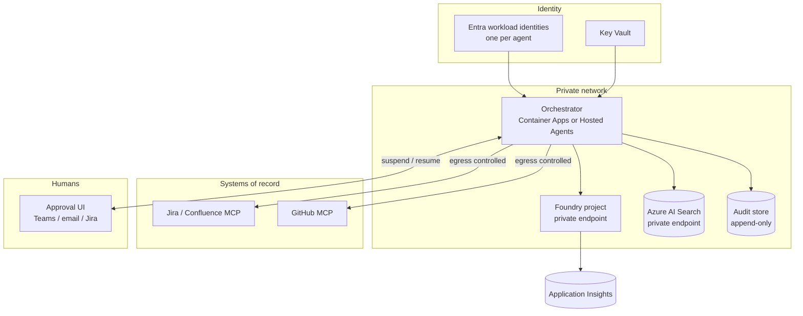

# From workshop to production

The workshop is faithful about the *shape* of the problem — typed handoffs,
content-bound approvals, enforced sequencing, an audit trail — and deliberately
unfaithful about almost everything else. This is the gap.

## The shortcuts, and what replaces them

| Workshop | Why it is fine here | Production |
|---|---|---|
| Search admin key in `.env` | Fictional corpus, disposable service | Managed identity with the Search Index Data Reader role; no keys anywhere |
| Agents run as your `az login` identity | One person, one laptop | A workload identity per agent, least privilege per system of record |
| Gate blocks on a console prompt | Gates resolve in seconds | Durable run state; approval arrives by Teams, email, or a Jira transition, hours or days later |
| `audit.jsonl` on local disk | Readable, obviously append-only | Append-only store with retention, access control, and integrity protection |
| Mock MCP servers | No credentials, resettable | Real MCP servers with OAuth, rate limiting, and error handling |
| Public endpoints | Nothing sensitive | Private endpoints for Foundry and Search; egress controls on MCP destinations |
| Corpus is trusted input | We wrote it | Untrusted retrieval requires prompt-injection defence and content safety |
| Human judgement at gates is the only quality bar | Two-hour session | Scored evaluation in CI on every instruction change |

## The four that actually take work

### 1. Durable, resumable runs

This is the biggest change, and it is bigger than it first looks. Today the run
lives in memory and a gate is a blocking prompt. Real gates take days.

You need run state persisted at every stage boundary, a resume path keyed by
approval, and idempotency so a resumed run does not recreate Jira issues it
already created. The Agent Framework's checkpointing support is a starting point;
the harder half is designing what a "run" is when it spans days and the approver
is on leave.

Design questions worth settling early: what happens when an approval arrives
after the design has been superseded, and who can cancel a run mid-flight.

### 2. Agent identity and least privilege

Agents currently act as the signed-in human, which means the audit trail records
*your* name against work an agent did. That is exactly backwards for
accountability.

Each agent gets its own Entra workload identity, scoped to what it needs: the
Work Breakdown Agent can create issues in one project and nothing else; the
Delivery Agent can open pull requests but not merge them; the Release Agent can
publish to one Confluence space. The audit record then names the agent, the
identity, and the human who approved.

Foundry's Hosted Agents give each agent a dedicated Entra agent identity, which
is the natural fit.

### 3. Audit that satisfies an auditor

A local JSONL file demonstrates the property and satisfies nobody. What is needed:

- append-only storage with enforced retention
- access control separating who can read from who can write
- integrity protection so the trail can be shown not to have been altered
- correlation across the whole initiative — requirement, design, story, pull
  request, release — via stable ids
- export in whatever form your auditors already accept

The `AuditSink` interface exists so this is a new implementation rather than a
rewrite. Make the durable store primary, and keep the local file as a
development convenience.

### 4. Evaluation as a gate on change

Instructions are code. A one-word change to an agent's instructions can
materially change behaviour with nothing to catch it.

Score the properties that matter — citations real and relevant, DoR assessments
matching human labels, escalation happening when it should and not when it
should not — and run them on every pull request touching `agents/` or `corpus/`.
[Take-home 5](../takehome/05-evaluation.md) builds the first version.

## Reference topology

## Sequencing a rollout

**Start where the artifact is reviewed anyway.** Requirements and design already
have approval steps and named accountable humans, so the agent slots into an
existing control rather than creating a new one. Adoption is about trust, and
trust is cheapest to build where the review already happens.

**Run in shadow first.** The agent drafts, the human drafts as usual, and you
compare. That gives you a labelled evaluation set as a by-product, which is the
thing you will most wish you had later.

**Move to assisted, then supervised.** Assisted: the agent's draft is the
starting point and the human edits. Supervised: the agent's output goes forward
unless the human objects. The second is a much bigger step than it sounds, and it
should be earned per stage rather than granted across the flow.

**Keep the gates longest where the blast radius is largest.** Writing to a
backlog is recoverable. Merging code and publishing a release are less so.

## What to measure

Whether this is working is a delivery question, not a model question:

- **Lead time** from approved requirement to merged code
- **Rework rate** — artifacts rejected at a gate, and how that trends as
  instructions improve
- **Gate latency** — how long artifacts wait for a human, which is usually where
  the real cycle time goes
- **Escalation rate** — how often agents ask, and whether the questions are good
- **Cost per initiative** in tokens against hours saved

The last one is the one people ask for first and it is the least interesting.
Rework rate and gate latency tell you whether the system is actually helping.
